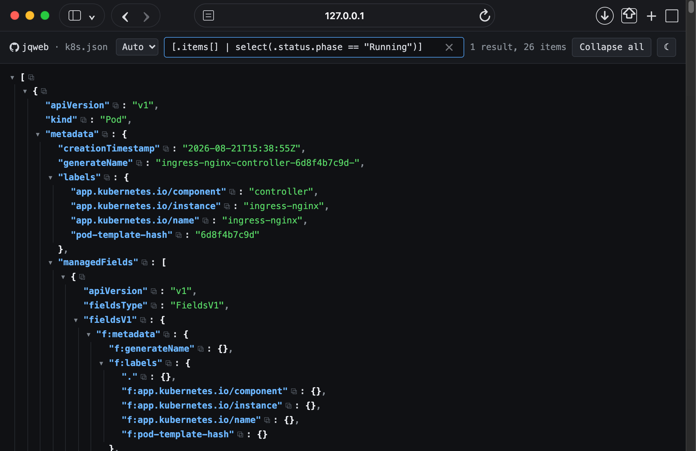

# jqweb
Renders json like jq, but as a webpage

## Example

**Quick view of json output. (See screenshot on right)**
```
$ curl -s 'https://en.wikipedia.org/api/rest_v1/?spec' | jqweb
jqweb: serving on http://127.0.0.1:52748/ (Ctrl-C to stop)
```



**Output to an html file for offline viewing**
```bash
$ kubectl get pods -o json | jqweb -o k8s.html
$ open k8s.html # Opens webpage in your browser
```

**Specify port and host**
```bash
$ jqweb --host 0.0.0.0 --port 9000 < input.json
jqweb: serving on http://[::]:9000/ (Ctrl-C to stop)
```
<br clear="right">

## Usage
usage: `jqweb [-p|--port <port>] [--host <ip>] [-o|--output <file>] [<input-file>]`

Reads JSON from <input-file> ("-" or absent: stdin) and renders it as a
self-contained interactive HTML page, served on a random port or written to file
```
  -p, --port <port>    serve the page on http://<host>:<port>/
      --host <ip>      bind address for -p (default 127.0.0.1)
  -o, --output <file>  write the page to <file>; "-" writes to stdout
```
With no -p and no -o, it listens on a random available port.


## Why?

Sometimes it's easier to view it in your webbrowser then search through large json output to
find the exact value you need, especially if you don't know the json path.

## License

MIT Copyright Nick Clifford
